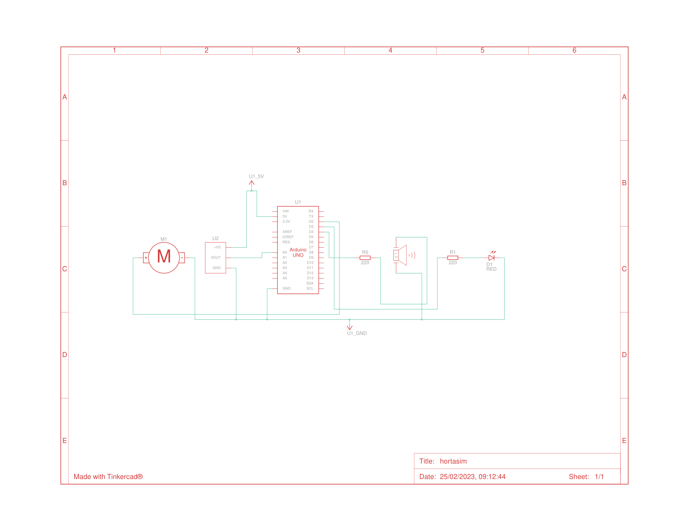

# iot-agro-hortasim
Um projeto de nível básico desenvolvido no simulador TinkerCad, que simula uma estufa de hortaliças com controle de temperatura e ventilação. O código é orientado por Diego Renan, Education Tech Lead da DIO

# Conexões:

# Esquema: 

