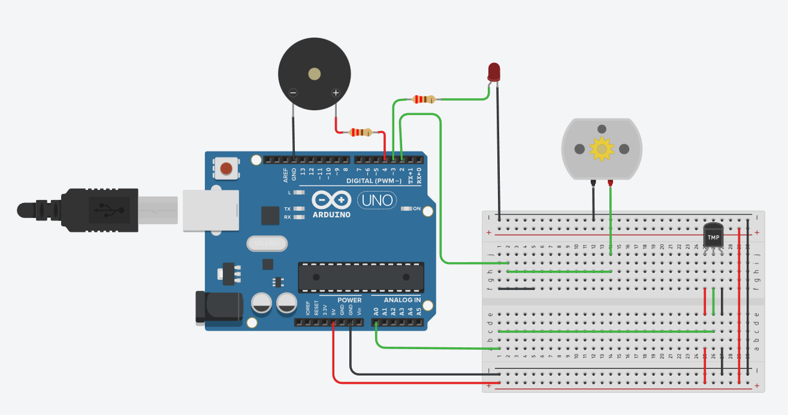

# iot-agro-hortasim
O projeto em questão é um exercício de nível básico em Internet das Coisas (IoT), desenvolvido no simulador TinkerCad, e orientado pelo Education Tech Lead da DIO Diego Renan. O objetivo é simular uma estufa de hortaliças e implementar um circuito eletrônico que faça o controle de temperatura, por meio de um sensor de temperatura, e atue de acordo com diferentes faixas de temperatura.

Para realizar o controle de temperatura, o projeto conta com um motor de ventilador que é acionado caso a temperatura ultrapasse 30°C, garantindo que o ambiente da estufa esteja sempre adequado para o cultivo de hortaliças. Além disso, caso a temperatura atinja valores acima de 50°C, um LED vermelho e uma buzina são acionados, emitindo um alerta de emergência.

O código do projeto foi escrito em linguagem C e programado na placa Arduino, seguindo os requisitos estabelecidos para o exercício. O projeto é uma excelente oportunidade para se aprofundar no mundo da IoT e explorar as diversas possibilidades de controle de ambientes e dispositivos por meio da programação de circuitos eletrônicos.

# Conexões:

# Esquema: 

